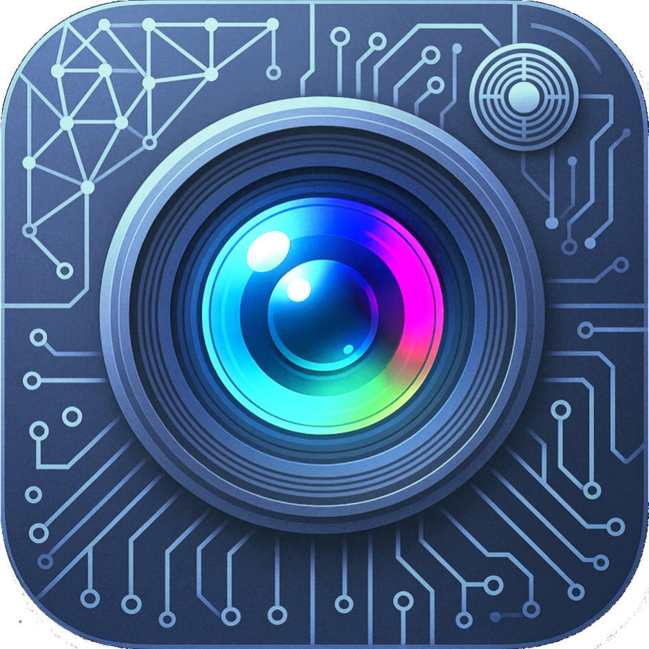
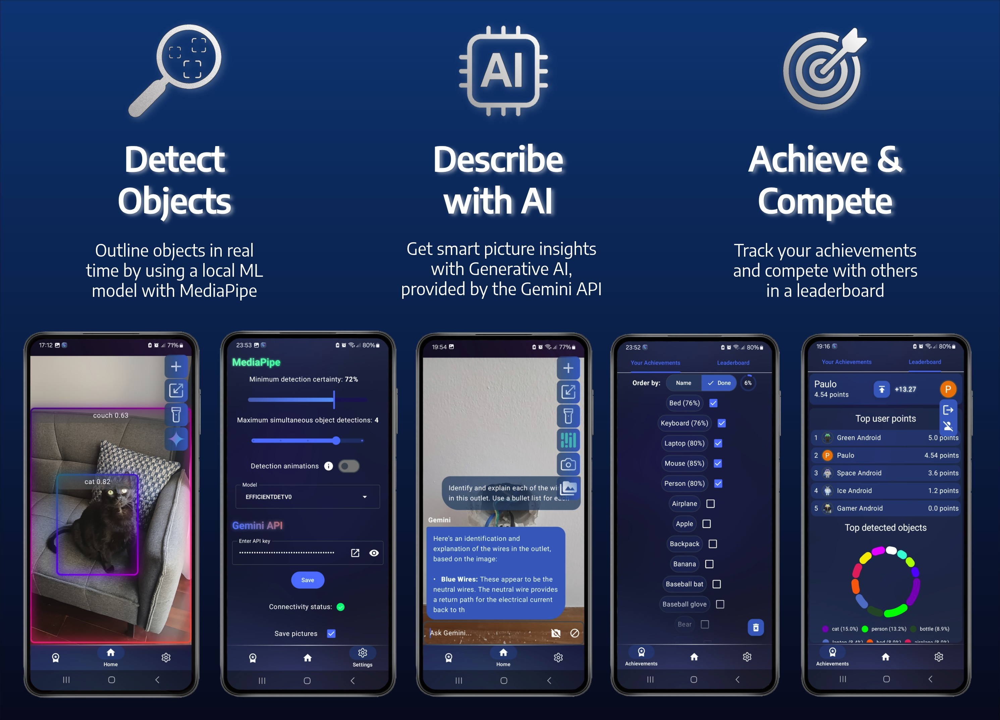

    
    <h3>Object Detector</h3>

     
    
     
    <h3>Demo 🎥</h3>
    

## Main Features ✨
- Detect very simple objects with MediaPipe
- Ask Gemini anything about a picture taken
- Tracks the user's achievements towards MediaPipe's detectable objects and provides a leaderboard for the users (that opted in by logging in with Google) towards those achievements. Along with statistics displaying the most detected objects.
- It supports various customizations and other features: 
    - Camera settings: ratio, flashlight and saving pictures taken
    - Model settings: detection sensitivity, max detection count, detection animations and the model itself (2 choices)
    - Notifications for achievements

## Primary Technologies 🛠️
| MediaPipe | Gemini API | Ktor | Firebase |
|:-:|:-:|:-:|:-:|
|  |  |  |  |

### 1. [MediaPipe](https://github.com/google/mediapipe)
- An open-source framework that facilitates the integration of AI & ML, made by Google. It's mostly geared towards lightweight devices or "edge devices" (mobile devices and embedded systems) and its cross-platform. 
- MP supports models authored in [LiteRT](https://developers.googleblog.com/en/tensorflow-lite-is-now-litert/) (formelly known as TensorFlow Lite (TFLite)), which is a framework and runtime for on-device AI that's also built by Google. LiteRT also supports models authored in PyTorch by [converting them](https://ai.google.dev/edge/litert/models/convert_pytorch)
- Here's a showcase of the [tasks MediaPipe supports](https://mediapipe-studio.webapps.google.com/home)
- I'm using the [Object Detection](https://ai.google.dev/edge/mediapipe/solutions/vision/object_detector/android) Mediapipe dependency and the provided pre-trained [models](https://ai.google.dev/edge/mediapipe/solutions/vision/object_detector#models) of the family "EfficientDet" developed by Google. These models can detect these [80 objects](https://storage.googleapis.com/mediapipe-tasks/object_detector/labelmap.txt)
- You can learn more about object detection  and in making your own model through these [DeepLearningExamples repository](https://github.com/NVIDIA/DeepLearningExamples/blob/master/PyTorch/Detection/README.md) by NVIDIA (example with PyTorch)

### 2. [Gemini API](https://aistudio.google.com/app/apikey)
- A RESTful API for performing HTTP requests to a Gemini model,
running in Google Cloud Platform. Doesn't require a GCP project, although you can associate it to
one or monitor the use of your API key
- Pricing: It has a reasonable free tier of [1.5k requests per day and other limits](hhttps://ai.google.dev/gemini-api/docs/rate-limits#current-rate-limits) for Gemini 2.0 Flash. [See it's capabilities and various details](https://ai.google.dev/gemini-api/docs/models/gemini#gemini-1.5-flash)

### 3. [Ktor (client)](https://ktor.io/docs/client-create-new-application.html)
- An open-source framework developed by JetBrains to create HTTP servers or clients
- I only use it's client component, in order to make HTTP calls to the Gemini API
- I use the built-in JSON serializer for sending and receiving (@Serializable) objects

### 4. [Firebase](https://firebase.google.com/docs/build)
- A cloud platform or BaaS (Backend As A Service) that provides a wide range of utilities for different environments (and programming languages) via SDK's (Software Development Kits) for each one. Firebase runs on Google Cloud infrastructure, but it contains Firebase-specific configurations and services
- I use it to store the achievement leaderboard of the users using [Cloud Firestore](https://firebase.google.com/docs/database/rtdb-vs-firestore?hl=en&authuser=0), which is a NoSQL document database. And also Firebase [Authentication](https://firebase.google.com/docs/auth) is used in order to sign-in users with Google
- [Cloud Functions](https://firebase.google.com/products/functions/?hl=en&authuser=0) are used to make use of [Firestore triggers](https://firebase.google.com/docs/functions/firestore-events?hl=en&authuser=0&gen=2nd) to update the user leaderboard and the object stats on document changes, and it requires setting up a Pay as you go (Blaze) billing plan (and you'll only have to pay after thousands of requests per day)
- [Check pricing here](https://firebase.google.com/pricing). The pay-start ceiling for Cloud functions is very high for the use case of the app, so it's basically free. You can also use the [300$ trial](https://firebase.blog/posts/2024/11/claim-300-to-get-started)

## Secondary Technologies 🛠️
| [Koin](https://insert-koin.io/docs/quickstart/android-annotations/) |                      [Coil](https://coil-kt.github.io/coil/)                      |                            [Mockk](https://mockk.io/)                             |       [Lottie](https://airbnb.io/lottie/#/android-compose)       |                             [Jetpack Compose UI Test](https://developer.android.com/develop/ui/compose/testing)                              | 
|:-------------------------------------------------------------------:|:---------------------------------------------------------------------------------:|:---------------------------------------------------------------------------------:|:----------------------------------------------------------------:|:--------------------------------------------------------------------------------------------------------------------------------------------:|
|  |  |  |  |  |
|                      For dependency injection                       |                      For efficient & flexible image loading                       |                            For object mocking in tests                            |                      For animated graphics                       |                                                             For instrumented tests                                                              |

### Plugins Used & Other Dependencies 🔌
#### Gradle Plugins 🐘
- [gradle-download-task by Michel Krämer](https://github.com/michel-kraemer/gradle-download-task) -> To facilitate the download of the small TFlite ML models. It is ran automatically after building the project. In gradle tool window, access these 2 tasks in the category "other"
- [Kotlin Serialization](https://kotlinlang.org/docs/serialization.html) -> Used to process Kotlin's @Serialization annotations, so that certain objects have a serializable format so they can be used by Ktor and some DataStore (preferences) objects
- [Kotlin Symbol Processing (KSP)](https://kotlinlang.org/docs/ksp-quickstart.html#add-a-processor) -> Used to process Koin's and Room's annotations, so that it generates code that allows these libs to run properly
- [Dokka](https://kotlinlang.org/docs/dokka-introduction.html) -> Documentation engine for KDoc comments. Run it via `./gradlew app:dokkaHtml`. Or in gradle tool window, access it in the task category "documentation"
- [Google Services](https://firebase.google.com/docs/android/setup#add-config-file) -> Used to process the `google-services.json` file and build other resources for the Firebase SDK to work

#### Other Dependencies 📚
- [androidx.camera.* dependencies](https://developer.android.com/jetpack/androidx/releases/camera)
- [google-accompanist](https://google.github.io/accompanist/) -> For permission utils
- [androix.datastore](https://developer.android.com/jetpack/androidx/releases/datastore) -> For the storage of user preferences
- [androidx.room](https://developer.android.com/jetpack/androidx/releases/room) -> For storage of more complex data-structures, like the achievements

## Core Tech Use Throughout The App

More details

- [docs](./docs)

- [GH rendered Mermaid diagrams](./docs/mermaid-diagrams.md)

## Setup Guide 🙌
> [!NOTE]
> Minimum Android version: 11 (API level 30)

### Option 1 - Download ⬇️
Get the app from the .apk file in [releases](https://github.com/p4ulor/Object-Detector-App-Public/releases). Built with Github Actions.

### Option 2 - Build from source 🔨 
- Download Android SDK or Install Android Studio (which comes with the Android SDK) and add the following line to the `local.properties` file (ceate if AS didn't create it, in the root of this project) to point to it. Per example `sdk.dir=/home/p4ulor/Android/Sdk`

1. Config 🔧
    - Decide if you want to comment out all firebase code so you don't have to create a firebase project or create your own and add your `google-services.json` file inside `app/`. Then try building the project
    - Connect your phone to the PC and run in a terminal at the root directory `./gradlew app:installDebug`
    - Or `./gradlew assembleDebug` to build a debug version, which will output an .apk file to `app/build/outputs/apk/debug`
    - For more info on building a signed .apk see [docs](./docs/README.md)
2. Get Gemini API Key 🔑
    - Get it at [Google AI Studio](https://aistudio.google.com/app/apikey). There's a link to this in the app too so you can better copy paste it from your phone's browser
3. When you're finished 🗑
    - If you logged in into the leaderboard, you can clear your data like so:
    1. Delete your account through the app. This will delete your account entry at the Firebase level
    2. Go to `My Google Account` -> `Security` -> [Your connection to third-party apps & services](https://myaccount.google.com/connections). And look for `Object Detector`. This will completely clear you account entry at your Google Account level

> [!IMPORTANT]  
> If the app isn't detecting objects with MediaPipe make sure you downloaded the models (should be performed automatically after a build via `finalizedBy`)
>   - ./gradlew _download1
>   - ./gradlew _download2

> [!TIP]
> The app is pretty solid, it's well documented, has a good structure, covers lots of topics, includes many composable previews, etc.
>
> I learned a lot and had so much fun. I hope you enjoy it too
>
> IT'S LIT! 🔥
